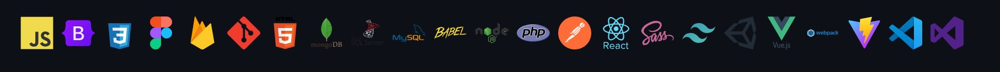

<h1 align="center">Hi 👋, I'm Alireza sadeghi</h1>

- 🦾 I'm **Front-End developer** & **UI / UX designer**
- 🚩 I'm currently working on www.raharan.com & www.refahiticket.com
- 👀 I’m interested in Programming
- 🌱 I’m currently learning **Nuxt.js...**
- 📫 How to reach me **khodemte@gmail.com**

<h3 align="left">Connect with me:</h3>

  
  

<h3 align="left">Languages and Tools:</h3>

